# Data Transformation Flow: From Raw CSV to Financial Statements

## Mermaid Diagram

```mermaid
flowchart TD
    A[📄 Raw Chase CSV Files] --> B[🔍 CSV Parser Engine]
    B --> C[🏷️ Transaction Categorization]
    C --> D[📊 Data Validation & Cleaning]
    D --> E[💰 Financial Calculations Engine]
    E --> F[📈 Financial Statements Generator]
    F --> G[🎨 Frontend Display]
    
    %% Raw Data Sources
    A1[Chase Checking Account<br/>5939_Activity_20250929.CSV] --> A
    A2[Chase Credit Card<br/>8008_Activity20230929.CSV] --> A
    
    %% Parser Details
    B --> B1[Parse CSV Structure<br/>• Extract columns<br/>• Handle quotes/commas<br/>• Filter empty rows]
    
    %% Categorization Process
    C --> C1[Client Payments<br/>• Laurel Management<br/>• Metropolitan Partners]
    C --> C2[Consultant Expenses<br/>• International wires<br/>• Bill.com payments<br/>• Swan services]
    C --> C3[Operating Expenses<br/>• Credit card autopay<br/>• Auto loan payments<br/>• Bank fees]
    C --> C4[Owner Equity<br/>• Account transfers<br/>• Wire reversals<br/>• Other credits]
    
    %% Validation Layer
    D --> D1[✅ Transaction Count Check<br/>• Verify all rows processed<br/>• Check for missing data]
    D --> D2[✅ Amount Validation<br/>• Sum debits and credits<br/>• Verify balance calculations]
    D --> D3[✅ Category Coverage<br/>• Ensure 100% mapping<br/>• Flag uncategorized items]
    
    %% Financial Engine
    E --> E1[📊 Golden Record Calculator<br/>• Single source of truth<br/>• Consistent calculations]
    E1 --> E2[Revenue Calculations<br/>• Business revenue only<br/>• Client payment totals]
    E1 --> E3[Expense Calculations<br/>• Consultant costs<br/>• Operating expenses<br/>• Total business costs]
    E1 --> E4[Equity Calculations<br/>• Owner contributions<br/>• Retained earnings<br/>• Other credits]
    
    %% Statement Generation
    F --> F1[📋 Income Statement<br/>• Revenue vs Expenses<br/>• Net Income calculation]
    F --> F2[⚖️ Balance Sheet<br/>• Assets = Liabilities + Equity<br/>• Point-in-time snapshot]
    F --> F3[💸 Cash Flow Statement<br/>• Operating activities<br/>• Financing activities<br/>• Cash reconciliation]
    
    %% Frontend Display
    G --> G1[🎯 Interactive Dashboard<br/>• Hover tooltips<br/>• Transaction details<br/>• Validation indicators]
    G --> G2[📊 Visual Charts<br/>• Financial metrics<br/>• Trend analysis<br/>• Key ratios]
    G --> G3[✅ Audit Trail<br/>• Calculation verification<br/>• Error highlighting<br/>• Reconciliation checks]
    
    %% Styling
    classDef rawData fill:#ffebee,stroke:#f44336,stroke-width:2px
    classDef processing fill:#e3f2fd,stroke:#2196f3,stroke-width:2px
    classDef validation fill:#fff3e0,stroke:#ff9800,stroke-width:2px
    classDef calculation fill:#e8f5e8,stroke:#4caf50,stroke-width:2px
    classDef output fill:#f3e5f5,stroke:#9c27b0,stroke-width:2px
    classDef frontend fill:#e0f2f1,stroke:#009688,stroke-width:2px
    
    class A,A1,A2 rawData
    class B,B1,C,C1,C2,C3,C4 processing
    class D,D1,D2,D3 validation
    class E,E1,E2,E3,E4 calculation
    class F,F1,F2,F3 output
    class G,G1,G2,G3 frontend
```

## Data Transformation Stages Explained

### Stage 1: Raw Data Ingestion 📄
- **Input**: Chase bank CSV files (checking account + credit card)
- **Content**: Raw transaction data with dates, descriptions, amounts, types
- **Challenges**: Inconsistent formatting, special characters, varying descriptions

### Stage 2: CSV Parsing & Structure 🔍
- **Process**: Parse CSV format, handle quotes and commas properly
- **Output**: Structured transaction objects with standardized fields
- **Quality**: Filter out empty rows, validate required fields

### Stage 3: Intelligent Categorization 🏷️
- **Client Payments**: Identify Laurel Management and Metropolitan Partners
- **Consultant Expenses**: Parse international wire transfers, Bill.com payments
- **Operating Expenses**: Credit card autopay, auto loans, bank fees
- **Owner Equity**: Account transfers, wire reversals, other credits

### Stage 4: Data Validation & Cleaning 📊
- **Transaction Coverage**: Ensure 100% of transactions are categorized
- **Amount Validation**: Verify debits and credits balance correctly
- **Data Integrity**: Check for missing or malformed data

### Stage 5: Financial Calculations Engine 💰
- **Golden Record**: Single source of truth for all financial calculations
- **Revenue**: Sum of all client payments
- **Expenses**: Categorized business operating costs
- **Equity**: Owner contributions, retained earnings, other credits

### Stage 6: Financial Statements Generation 📈
- **Income Statement**: Revenue - Expenses = Net Income
- **Balance Sheet**: Assets = Liabilities + Owner's Equity
- **Cash Flow**: Operating + Investing + Financing activities

### Stage 7: Frontend Display & Validation 🎨
- **Interactive Dashboard**: Hover for transaction details
- **Visual Indicators**: Green checkmarks for validated calculations
- **Audit Trail**: Show calculation verification and reconciliation

## Key Quality Controls

1. **100% Transaction Mapping**: Every transaction gets categorized
2. **Mathematical Verification**: Multiple calculation cross-checks
3. **Statement Reconciliation**: All three statements must balance
4. **Visual Validation**: Green checkmarks show successful validation
5. **Audit Trail**: Full traceability from raw data to final statements

## Business Value

- **Accuracy**: Automated categorization reduces human error
- **Consistency**: Golden record ensures all statements use same data
- **Transparency**: Full audit trail from source to final output
- **Efficiency**: Automated processing vs. manual spreadsheet work
- **Reliability**: Multiple validation checkpoints ensure data integrity
